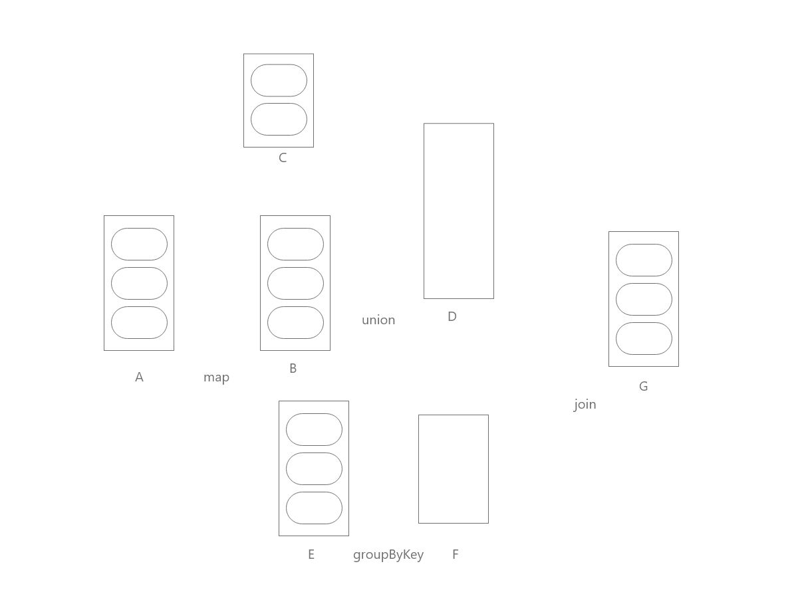

# 2019云计算试卷

一、云计算中的部署模型有哪些分类(10分)  
二、亚马逊弹性计算云如何存储数据 (10分)  
三、试描述亚马逊Dynamo如何发现服务器出错和恢复(10分)  
四、简要描述如何使用MapReduce模型来计算大规模图中的单源最短路径，并写出mapper和reducer的伪代码(10分)  
五、说明虚拟化对云计算的作用(列举3点)(10分)  
六、请说明自动伸缩监听器的作用(10分)  

七、(总分确定，小题给分不确定)  
1)Spark生态中有哪些部分，这些部分的相互关系是什么(5分)  
2)请简要描述Spark Streaming，Graphx，MLlib(5分)  
3)请分别说明Application，Driver，ClusterManager，WorkerNode，Executor，Task，Stage，Job这些概念(10分) 

八、  
1)RDD的英文全名是什么(2分)   
2)请写出RDD的五大特征(10分)  
3)给定下列图，有如下关系:A-map->B; B,C-union->D; E-groupByKey->F; D,F-join->G。请补充分片和依赖关系，并画出Stage(8分)  

