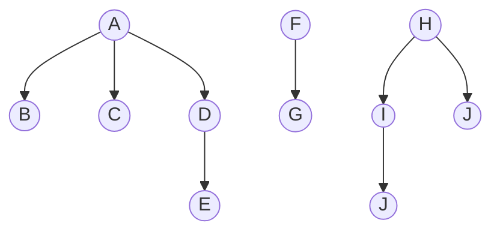
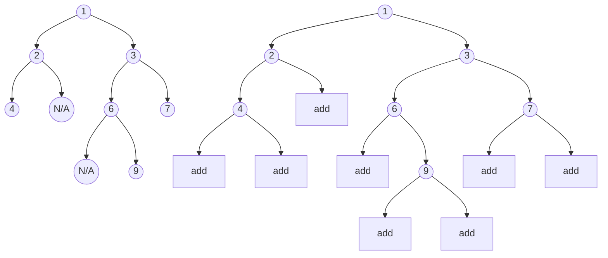
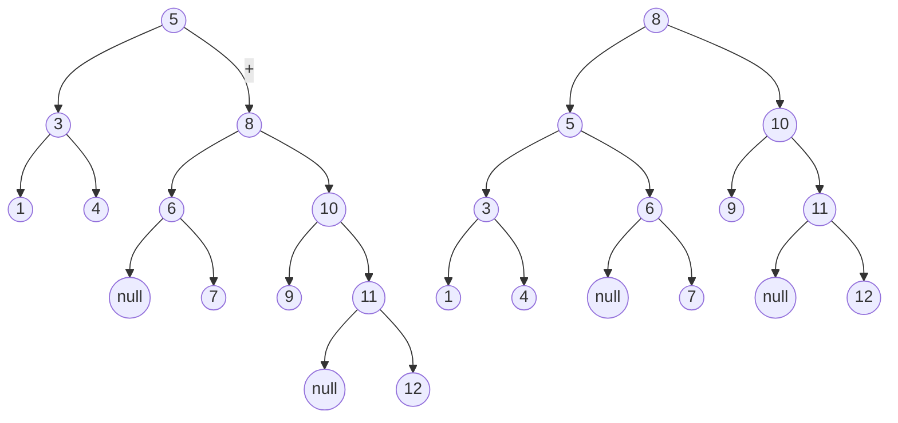
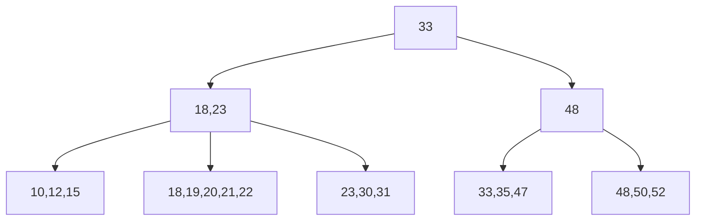

## 4.Trees

### 4.0 Trees

由于时间限制，就先不讲简单的操作，前面的先序后序遍历左右子树的概念比较简单。

这里主要提一下森林与二叉树的转换。

#### 4.0.1 森林与树的转换




1. 将每棵树转换成二叉树：宽度优先遍历，兄弟进右节点，子女进左节点

   ```mermaid
   graph TD
   1((A))-->2((B))
   1-->b[null]
   2-->a[null]
   2-->3((C))
   3-->x[null]
   3-->4((D))
   4-->5((E))
   4-->c[null]
   6((F))-->7((G))
   6-->p[null]
   8((H))-->9((I))
   8-->o[null]
   9-->10((J))
   9-->11((J))
   ```


2.  把每个二叉树用右链相连。

   ```mermaid
   graph TD
   1((A))-->2((B))
   1-->6((F))
   2-->a[null]
   2-->3((C))
   3-->b[null]
   3-->4((D))
   4-->5((E))
   4-->c[null]
   6-->7((G))
   6-->8((H))
   8-->9((I))
   8-->d[null]
   9-->10((R))
   9-->11((J))
   ```

   森林的先根：访问第一棵树的根->访问这棵树的先根遍历->先根遍历其他树的森林：相当于二叉树的先序

   中根：中序

   后根：后序

   ​

#### 4.0.2 Thread Tree 线索树

为了充分利用节点中的空域，我们加入了前驱或者后继的运算。

一个节点中现在加入了这些参数中，每个节点有如下域：

leftchild，leftthread，data,rightthread,rightchild

$leftThread= \begin{cases} 0:leftchild指向左子女 \\\ 1:leftchild指向前驱 \end{cases}$

$rightThread= \begin{cases} 0:rightchild指向右子女 \\\ 1:rightchild指向后继 \end{cases}$

构造中序线索树的方法：相当于中序遍历，要填充左空域和右空域的前驱指针和后继指针，所以除了流动的指针p以外还要加一个pre指针，总是指向遍历指针p的中序前驱节点。

sample code：

```c++
//Thread Tree
//Create inorder threadTree:
void Inthread(threadNode<T> * T)
{ 
	stack <threadNode <T> *> s (10)
	ThreadNode <T> * p = T ; ThreadNode <T> * pre = NULL;
	for ( ; ; )
    {
    while (p!=NULL)
		{ s.push(p); p = p ->leftchild; }
	if (!s.IsEmpty( ))
	{  
     	p = s.pop;
		if (pre != NULL)
		{
    		if (pre ->rightchild = = NULL)
        	{
        		pre ->rightchild = p; pre ->rightthread = 1;
        	}
			if ( p -> leftchild = = NULL)
			{
        		p -> leftchild = pre ; p ->leftthread = 1; 
        	}
		}
		pre = p ; p = p -> rightchild ;
		}
	else return;
	}//for
}
```

 #### 4.0.2Huffman Tree

增长树的概念：对原来的二叉树中degree=1的节点，增加一个空树叶。

对原来的二叉树中的树叶，增加两个空树叶



> 垃圾mermaid……不能画空节点只好把写着N/A或者NULL的节点作为空节点了


### 4.1 Binary Search Tree


​	二叉搜索树的左节点小于节点，右节点大于节点。这就带来了一种性质：

$$ \forall node \in BinaryTree,node.left<node<node.right$$

也就是说二叉搜索树的中序遍历是一个从小到大排好序的序列。

#### 4.1.1 二叉搜索树的结构

| leftsize | left | element | right |
| -------- | ---- | ------- | ----- |
|          |      |         |       |

*leftsize是左子树的element数量+1

**提供的构造函数：两种，一种是叶节点，左右子树都是null，另一种是根节点。**

```java
class BinaryNode{
	Comparable element;
  	BinaryNode left;
  	BinaryNode right;
	BinaryNode(Comparable theElement){
        this(theElement,null,null);
    }
	BinaryNode(Comparable theElement,BinaryNode lt,BinaryNode rt){
        element]theElement;left=lt;right=rt;
    }
  Comparable lelement;
  BinaryNode left;
  BinaryNode right;
}
```

提供的方法：

查找-查找最大-查找最小

插入/删除/查找　　　　　　　　　　　　　　　　　　

以及取出index处的内容的elementAt

#### 4.1.2  具体方法的实现

**查找**

注意：这里的算法都是递归调用，函数返回的是node t；比如说第x层调用了x+1层的函数（函数中的t修改为原来t的某个子树）那么x+1层将操作之后的t返回。

这个时候比如我写t.left=f();那么x+1层操作后返回的顶node的索引就是这一层的t的左子树了。这里要讲一下主要是为了之后讲删除那一块。后面会提到。


*结束1*

如果当前node已经变成null了，对不起树跑完了，return null

*结束2*

如果当前node等于查找的值，return

*递归*

如果查找的值小于当前node的值，递归查找左子树（说明你的这个数据小了当然是存在左边啦～

如果查找的值大于当前node的值，递归查找右子树。

```java
private BinaryNode find( Comparable x, BinaryNode t )
 {  if( t = = null )
           return null;
     if( x. compareTo( t.element ) < 0 )
           return find( x, t.left );
     else if( x.compareTo( t.element ) > 0 )
           return find( x, t.right );
     else
          return t;  //Match
 }
```


**查找最小**

*结束1*

如果当前的node已经变成null了，那你的树爆了洗洗睡吧

*结束2*

如果你的node的左子树变成null，那你找了这个二叉树的最左下角的元素，那就是最小的了

*递归*

如果没有到左下角那么就找左子树吧

```java
private BinaryNode findMinRecurcive( BinaryNode t )
 {   if( t = = null )
           return null;
      else if( t.left = = null )
           return t;
      return findMin( t.left );
 }

private BinaryNode findMaxNonRecurcive( BinaryNode t )
 {   if( t != null )
         while( t.right != null )
             t = t.right;

      return t;
 }
```

**插入（雾）**

*结束1*

发现重复元素，啥都不做退出。

*结束2*

当t为null也就是走到了空的地方，也就是t的“窝”也就是我们需要插入的地方，变成空的了，那么这个时候就新建一个节点插进去。因为我们是递归的，return的是当前的node，那么直接return node就可以了。

*递归*

如果x<当前element，那么找左子树。

如果x>当前element，那么找右子树。

```java
private BinaryNode insert( Comparable x, BinaryNode t ){\
	  if( t = = null )
          t = new BinaryNode( x, null, null );
      else if( x.compareTo( t.element ) < 0 )
          t.left = insert( x, t.left );
      else if( x.compareTo( t.element ) > 0 )
          t.right = insert( x, t.right );
      else
           ;   //duplicate; do nothing
      return t;
 }

```

**删除**

注意，每次删除之后要~~处理后事~~维护二叉搜索树。

*结束1*

节点是null，爆了，return t吧。为什么return t前面说过了，相当于啥也不做。

*结束2*

如果左右子树都有，那么将右子树最小的元素拎出来代替删除元素的位置，然后递归对右子树进行删除并调整现在的元素

*递归*

先遍历寻找x

找到之后：

1.只有一个子树：看看左子树是不是null，如果是就返回右子树，否则左。这里包含了叶节点，反正两边都是null，返回哪个都一样。

2.有俩子树：先把右子树找一个最小的元素，用它的内容替换现在的节点的内容，之后再删掉它（合在一起就是：用右子树最小的节点替换该节点，只不过这种有索引的东西删除一般都不大~~来势~~好用）删除的方法就是去掉这个node，它的

之所以要删除右子树的最小元素，是因为这个元素是它的中序后继。

```java
private BinaryNode remove( Comparable x, BinaryNode t )
 {    if( t = = null )
          return t;
       if( x.compareTo( t.element ) < 0 )
           t.left = remove( x, t.left );
       else if( x.compareTo( t.element ) > 0 )
           t.right = remove( x, t.right );
       else if( t.left != null && t.right != null )
              {   t.element = findMin( t.right ).element;
                  t.right = remove( t.element , t.right );
              }
       else
            t = ( t.left != null ) ? t.left : t.right;
 }

```

#### 4.1.3 二叉

#### 搜索树的其他知识

嘿嘿怕了吧

其实就只有一个内容，就是树的高度。

树的高度就是层数，包含根和叶。

平均下来的话，对于有n个数据的二叉搜索树，高度是$\lfloor \log{2}n \rfloor+1$,也就是说，相关时间复杂度是$ O(\log_2 n)$


EOF


### 4.2 AVL Tree

#### 4.2.1 AVL Tree

二叉搜索树

每一个节点满足如下关系：

$ \forall node, \left| h_L-h_R\right| \leq1,​$where $h_R ​$ and ​$h_L​$ are the heights of ​$T_L​$(left subtree)and ​$T_R​$(right subtree)respectively

树的高度：从根到叶最长的一条路

balance factor：bf(x)右子树高度减去左子树高度


结构：

left，data，right，balance

算法复杂度：$O(\log_2 n)$

** **

**插入 **

**这里一定要看ppt**

AVL树的插入一直是一个难点。笔者认为可以这么想：

有两种旋转方式，单旋转，双旋转。

分别有两个方向。

| -    | 单    | 双    |
| ---- | ---- | ---- |
| 左    | 左单旋转 | 左双旋转 |
| 右    | 右单旋转 | 右双旋转 |

基本算法：插入时向上回溯，检查左右子树的高度差，如果高度差>1，那么开始调整。此时我们将左右子树高度差大于一的节点，称为	$Node_\alpha$,这个节点的

调整分为两种情况：

* 外侧变高：

  单旋转

  $Node_\alpha$的外节点$Node_\beta$替换$Node_\alpha$的位置（划重点！不是整个替换，$Node_\alpha$是要顺延往后的），重新构建树。重新构建树的过程可以看作是直接把$Node_\beta$的内侧子树加到$Node_\alpha$的内节点来。$Node_\beta$外侧的节点就跟着$Node_\beta$。

  可以这么理解：替换就是把$Node_\beta$拎起来到$Node_\alpha$的位置.

  * 右子树外侧变高：

    **左单旋转：$Node_\alpha$的右节点$Node_\beta$替换$Node_\alpha$，重新构建树。由于二叉搜索树的特性，调整之后，$Node_\alpha$成为$Node_\beta$的左子树，那么$Node_\alpha$就没有右子树了。重建树的时候，总是把$Node_\beta$的左子树加到$Node_\alpha$的右节点，于是我们可以看作是直接把右节点左子树加到右节点来。$Node_\beta$外侧的节点就跟着$Node_\beta$。**

    这个可以自己体会一下。

  * 左子树外侧变高：

    把右和左对调就是。

  其实左右变换是统一的，左右变了，但是内外侧关系不变。

* 内侧变高：

  双旋转：先对$Node_\beta$做一次反向的单旋转，再对$Node_\alpha$做一次正向的单旋转，是为双旋转。

  反向什么意思，啊懂？外侧变成内侧，~~好好体会一下~~

举例：


总结：掌握单旋转的含义。要意识到无论单旋转还是双旋转都事为了满足二叉搜索树的左小右高的性质，所以外侧变高的时候从小到大是一个直线，一个旋转就能解决，而内侧变高的时候要转成类似于外侧变高的情况再旋转。包括“过继”子树的情况也是基于这个原则。

注：这里的外侧内侧是相对于右、左子树加高的情况：对于最小不平衡节点，右子树加高则右侧是外侧，左侧是内侧，否则反之，能明白吧w

单旋转：

1.以子树高度差>1的节点为基，称之爸爸。

2.【爸爸】的【外侧儿子】不孝，带着外侧子树夺取了他爸爸的位子。

3.儿子的内侧子树，扔给爸爸空虚的外侧

双旋转：

1.【外侧儿子】和他的【内侧孙子】反过来单旋转（孙子带着内侧子树替换儿子，孙子外侧子树给儿子内侧

2.爸爸和他的外侧儿子正向单旋转。


每次都做。

```java
class AVLNode
 {   
  AVLNode( Comparable theElement ){
    this( theElement, null, null ); 
  }
  AVLNode( Compalable theElement, AVLNode lt, AVLNode rt ){
    element = theElement; left = lt; right = rt; height = 0; 
  }

  Comparable element;
  AVLNode left;
  AVLNode right;
  int   height;
  
  private static int height( AVLNode t ){
    return t = = null ? –1 : t . height;
  }
  private AVLNode  insert( Comparable x, AVLNode t ){
  	if ( t = = null )
    	t = new AVLNode( x, null, null );
    else if ( x.compareTo( t.element ) < 0 ){
    	t.left = insert( x, t.left );
    	if( height( t.left ) – height( t.right ) = = 2 )
        	if( x.compareTo( t.left.element ) < 0 )
            	t = rotateWithLeftChild ( t );
        	else  t = doubleWithLeftChild( t );
  	}
    else if( x.compareTo( t.element ) > 0 ){
    	t.right = insert( x, t.right ) ;
    	if( height( t.right ) – height( t.left ) = = 2 )
        	if( x.compareTo( t.right.element ) > 0 )
            	t = rotateWithRightChild( t );
            else  t = doubleWithRightChild( t );
        }
        else
           ;
        t.height = max( height( t.left ), height( t.right ) ) + 1;
        return t;
 	}
  
   private  static  AVLNode  rotateWithLeftChild( AVLNode k2 ){
   		AVLNode k1 = k2.left;
      	k2.left = k1.right;
      	k1.right = k2;
      	k2.height = max( height( k2.left ), height( k2.right ) ) + 1 ;
      	k1.height = max( height( k1.left ), k2.height ) + 1;
      	return k1;
   	}
  	private  static  AVLNode  doubleWithLeftChild( AVLNode k3 ){
      	k3.left = rotateWithRightChild( k3.left );
      	return rotateWithLeftChild( k3 );
 	}
}
  

  

   
```

### 4.3 B-Tree

#### 4.3.1 m-way search tree

m路搜索树的定义与二叉搜索树类似。

举例：

7路搜索树：每一个节点有6个数据，数据之间的指针指向子树；类似于植树问题，两边都栽树。我们假设这些数据是$k_0,k_1,...,k_5$，数据之间的指针指向的子树为$c_0,c_1...c_6$：

c0 k1 c1 k2 c2 k3 c3 k4 c4 k5 c5 k6 c6

* $c_0$:$c_0$里面的elements大于$k_1$
* $c_i(0 \lt i \lt 6)$ :$c_i$里面的elements大于$k_i$.(小于$k_{i+1}$ )
* $c_6$:$c_6$里面的elements大于$k_6$


对应关系：

m-way search tree->binary search tree

b-tree->avl tree

其他的基本和平衡树差不多


在这里提一下$B^+$树。

4.3.2

b-tree：讲过。



注：最底下的叶节点，有一个链表结构

-->[10,12,15]-->[18,19,20,21,22]-->[23,30,31]-->[33,35,47]-->[48,50,52]

mermaid画不出来。。。:smile:

$B^+$tree：关键码只分布在叶节点上，由于除了树的结构，在叶节点还有线性的链表结构，所以是一个双索引结构，在搜索的时候有一定优势与灵活性，既可以线性搜索，也可以递归搜索。

当插入更多关键码时，索引结构会改变。所以又称为动态索引结构。

删除时，上层的分界关键吗可以不删除，作为之后的依据。


