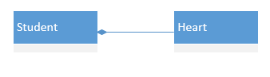
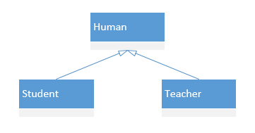
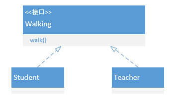

# 各类图

## 数据流图（DFD） *非重点*

### 图例

|                  两种图例规格都可以                   |
| :---------------------------------------------------: |
|  |

### 上下文图、0层图和N层图

上下文图是DFD的最高层次的图，是系统功能的最高抽象。上下文将整个系统看做一个过程，这个过程实现系统的所有功能。

| 0层图通常被用作整个系统的功能概图 | 1层图分析以确定下一级转换； | 从0层图到N层图，结构不断细化； |
| :-------------------------------: | :-------------------------: | :----------------------------: |
|          |    |       |

#### 过程分解的平衡原则

## 实体关系图（E-R） *非重点*

> 这其实是数据库课程里详细讲的事情

### 图例

- **传统实体**：实体是需要在系统中收集和存储的现实世界事物的类别描述

- **属性**：根据对象包含的一组作为对象的方面、质量、特征或描述符的属性

- **关系**：传统实体之间的关系

| 圈就是0，竖线是1，三叉是多                           |
| ---------------------------------------------------- |
|  |

### 建立步骤

1. 对所有数据对象(实体)及其相互之间的"连接"建模
2. 对所有实体和关系建模
3. 对所有实体、关系和属性建模，以提供进一步的深度

## 用例图（UCD）

### 用例

用例是在系统(或者子系统或者类)和外部对象的**交互**当中所执行的行为序列的描述,包括**各种不同的序列和错误的序列**,它们能够联合提供⼀种**有价值的服务**"[Rumbaugh2004]。

### 图例

1. **⽤例**：椭圆
2. **参与者**：小人，是系统或其他系统对要开发的系统所扮演的角色。
3. **关系**：简单的就是一条直线，包括相关、泛化关系、包含关系和继承关系。
4. **系统边界**：是一个框

### 建立步骤

1. 目标分析与解决方向的确定：需要实现什么（属于需求部分）；
2. 寻找参与者；
3. 寻找用例；
4. 细化用例:判断标准是用例描述了为应对**一个业务事件**，由**一个用户**发起，并在**一个连续时间段**内完成，可以**增加业务价值**的任务。

### 注意

1. **不要将用例细化为没有独立业务价值的单个操作**：例如,不要将用户管理细化为增加、修改和删除三个更⼩的用例,因为它们要联合起来才能体现出业务价值。 
2. **不要将同⼀个业务目标细化为不同用例**：例如**特价策略制定和赠送策略制定**。
3. **不要将没有业务价值(而是技术实现需要)的内容作为用例**：常见的错误有**登录**(应该描述为安全性质量需求)、"数据验证/输入/输出数据检查"(应该描述为数据需求或者业务规则)、"连接数据库"(属性软件内部实现⽽不是需求)、网络传输等。 
4. **不要将单个步骤细化为用例**。
5. **不要将片面的一个方面细化为用例**。

## 概念类图（分析类图）（CD）

### 图例

#### 对象

+ 标识符:对象自治、对象请求写作
+ 状态:存储数据，如密码、名称
+ 行为:利用数据做什么

#### 类

对象集合的抽象

#### 链接(link)(dependency)

+ 对象之间的互相协作的关系
+ 描述了对象之间的物理或业务联系

#### 关联

+ 对象之间链接的抽象
+ `聚合`与`组合`，聚合集合可以为空

#### 继承:泛化关系

#### 相关UML图例

| 关系类型                     | UML图例                                                      |
| ---------------------------- | ------------------------------------------------------------ |
| 依赖                         |  |
| 关联 （双向关联没有箭头） |  |
| 聚合                         |  |
| 组合                         |  |
| 泛化-继承                    |  |
| 泛化-实现接口                |  |

#### 总结

### 建立步骤

#### 候选类识别(行为 + 状态)

1. 行为分析
2. 名词分析
3. CRC

1. 对每个用例文本描述，尤其是场景描述，建⽴**局部**的概念类图
   + 根据用例的⽂本描述，**识别候选类**(名词分析法)
   + **筛选候选类**，确定概念类(状态和行为)
     + 状态和行为:概念类
     + 状态:其他概念类的行为
     + 行为:需求是否遗漏
     + 无状态无行为:完全剔除
   + **识别关联**
   + **识别重要属性**
2. 将所有用例产⽣的局部概念类图进⾏合并，建⽴软件系统的整体概念类图
3. 先画关联关系，再添加类的属性

## 顺序图-交互图

### 图例

|                                                              |                                                              |
| ------------------------------------------------------------ | ------------------------------------------------------------ |
|  | `opt`可选可不选，每一种可选分支之间要用虚线分割， 而且在表示执行态的圆柱上面要写监护条件，放在[]里面 `alt`必须选一个 `loop`循环+条件 |

### 示例

| 交互的双方是`用户`和`系统`两个整体， 该图可以展示系统与外部的交互 | 这里交互的多方是系统中具体的类， 该图可以反映系统运行时的顺序 |
| ------------------------------------------------------------ | ------------------------------------------------------------ |
|  |  |

### 建立步骤

1. 确定上下文环境
2. 根据用例描述找到交互对象
3. 按照用例描述中的流程顺序逐步添加消息s

## 状态图

### 图例:

- **状态**：一组可观察的情况，描述了一个系统在给定时间的行为

- **状态转换**：从一个状态到另一个状态的转换

- **事件**：使系统表现出某种可预测的行为形式的事件

- **行为**：由于过渡而发生的过程

### 建立步骤

1. 确定上下文环境，明确状态主体和状态主题对应的上下文环境
2. 识别状态：状态的主体表现出的一些稳定状态
3. 建立状态转换：建立状态之间的转换。
4. 补充详细信息，完善状态图